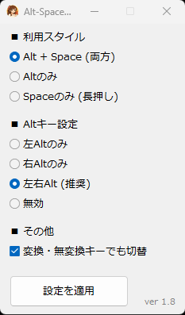

# Alt Space IME Pro v1.8

**「不便」を「便利」に。日本語入力を劇的にスムーズにするツール。**

---

# 👥 チーム
- **作成者（Lead Developer）**: マリナ (Marina)
- **企画・設計（Producer）**: M氏 (Masa Tech)
- **動作環境**: Windows 10 / 11
## 📝 概要
「Alt-Space-IME-Pro」は、日本語入力の切り替えをスムーズにするツールです。
Macのように左右のAltキー単体でIMEのオン・オフを切り替えられるほか、Spaceキーの長押しや変換・無変換キーへの機能割り当てなど、タイピングスタイルに合わせた最適な入力環境を提供します。

## ✨ 主な機能
1. **左右Altキーの単体押し**: IMEをオン・オフ切り替え（空打ち対策済み）。
2. **Spaceキーの長押し (0.3秒以上)**: IME切り替え。
3. **変換・無変換キー**: IME切り替え（設定でON/OFF可能）。
4. **カスタマイズ**: 設定画面（`Ctrl+Alt+I`）から、自分好みのスタイルに調整可能。
5. **自動実行**: スタートアップ登録機能により、Windows起動時に自動で立ち上がります。

## ⌨️ ショートカットキー
- `Ctrl + Alt + I` : 設定画面を表示
- `Ctrl + Alt + R` : IME状態のリセット
- `Ctrl + Alt + Q` : アプリの終了

  

## 🚀 使用方法
1. [Releases](https://github.com/MasaTech-Japan/Alt-Space-IME-Pro/releases) から最新の `AltSpaceIME_v1.8.exe` をダウンロードしてください。
2. 実行するとタスクトレイにアイコンが表示され、すぐに使えます。

## 🔗 関連情報
詳しい設定方法や更新情報は、ブログ「まさTech」をご覧ください。
[まさTech ブログはこちら]([ここにブログのURL](https://masatech.hatenablog.jp/)

## ☕ 応援（寄付）について
本ソフトが気に入りましたら、応援していただけると非常に励みになります！
- **応援用URL**: [https://giftee.com/u/masatech_777](https://giftee.com/u/masatech_777)

---
*免責事項：本ソフトの使用によって生じた、いかなる損害についても作者は一切の責任を負いません。個人の責任においてご使用ください。*
